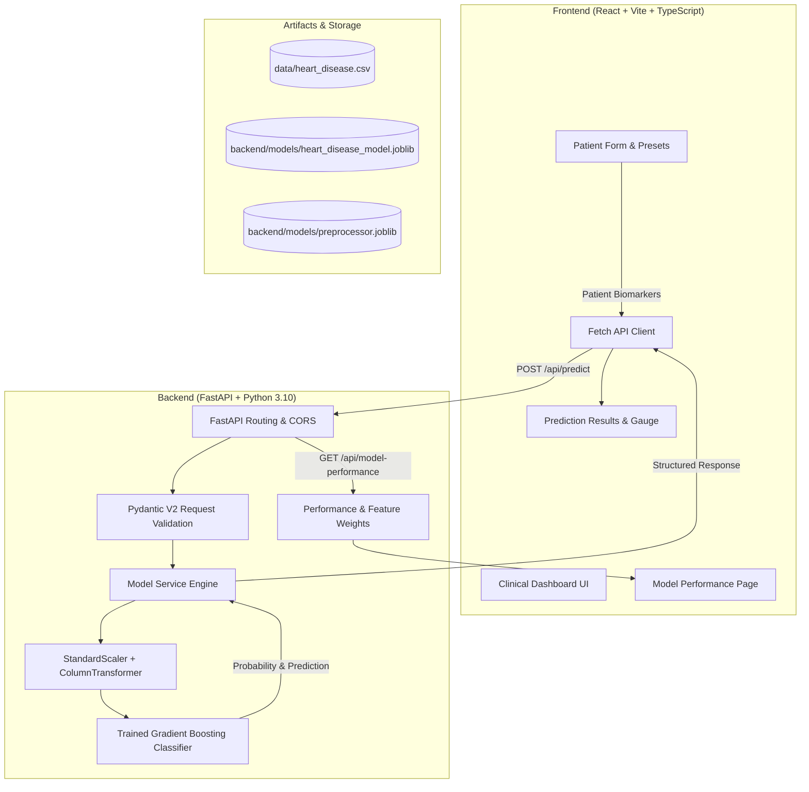

# CardioSense CDSS — Heart Disease Risk Clinical Decision Support System

[](https://fastapi.tiangolo.com)
[](https://reactjs.org)
[](https://www.typescriptlang.org/)
[](https://scikit-learn.org/)
[](https://tailwindcss.com/)
[](LICENSE)

**CardioSense CDSS** is a production-grade Clinical Decision Support System (CDSS) designed to assist healthcare professionals in evaluating coronary heart disease risk. Powered by a supervised machine-learning pipeline trained on validated cardiac cohort data, CardioSense delivers calibrated probability scoring, clinical risk stratification, feature importance explainability, and evidence-based decision support guidance.

> **Important Medical Disclaimer**: CardioSense CDSS is an assistive clinical decision support tool and is **not an autonomous medical diagnosis system**. All model outputs require validation by qualified healthcare professionals alongside diagnostic imaging, laboratory tests, and complete patient history.

---

## 📑 Table of Contents
1. [System Architecture](#system-architecture)
2. [Tech Stack](#tech-stack)
3. [Dataset & Clinical Features](#dataset--clinical-features)
4. [Machine Learning Pipeline & Evaluation](#machine-learning-pipeline--evaluation)
5. [System Features](#system-features)
6. [Project Structure](#project-structure)
7. [Local Setup & Running](#local-setup--running)
8. [API Documentation](#api-documentation)
9. [Deployment Guide (Vercel & Render)](#deployment-guide)
10. [Medical Disclaimer & Ethics](#medical-disclaimer--ethics)

---

## 🏛️ System Architecture



---

## 💻 Tech Stack

- **Backend**:
  - Python 3.10+
  - FastAPI (High-performance async REST API, auto OpenAPI/Swagger docs)
  - Pydantic V2 (Strict schema validation & typing)
  - Scikit-Learn 1.7+ (ML training, transformers, and evaluation)
  - Pandas & NumPy (Data manipulation & numerical operations)
  - Joblib (Model and transformer serialization)
  - Uvicorn (ASGI web server)
- **Frontend**:
  - React 18+ & Vite 8+
  - TypeScript (Strict type safety)
  - Tailwind CSS 3.4+ (Clinical UI design system)
  - Lucide React (Clinical iconography)
- **Deployment**:
  - Backend: Render (`render.yaml`)
  - Frontend: Vercel (`vercel.json`)

---

## 📊 Dataset & Clinical Features

The system uses the 1025-record Kaggle / Cleveland Extended Heart Disease dataset (`data/heart_disease.csv`).

| Feature | Type | Range / Codes | Clinical Description |
| :--- | :--- | :--- | :--- |
| `age` | Numerical | 29 – 77 yrs | Patient age in years |
| `sex` | Categorical | 0 = Female, 1 = Male | Biological sex |
| `cp` | Categorical | 0 = Typical angina<br>1 = Atypical angina<br>2 = Non-anginal pain<br>3 = Asymptomatic | Chest pain presentation |
| `trestbps` | Numerical | 94 – 200 mm Hg | Resting blood pressure at hospital admission |
| `chol` | Numerical | 126 – 564 mg/dl | Serum cholesterol measurement |
| `fbs` | Categorical | 0 = ≤ 120 mg/dl<br>1 = > 120 mg/dl | Fasting blood sugar (> 120 mg/dl indicates diabetes) |
| `restecg` | Categorical | 0 = Normal<br>1 = ST-T wave abnormality<br>2 = Left ventricular hypertrophy | Resting 12-lead ECG findings |
| `thalach` | Numerical | 71 – 202 bpm | Maximum heart rate achieved during stress test |
| `exang` | Categorical | 0 = No, 1 = Yes | Exercise-induced angina |
| `oldpeak` | Numerical | 0.0 – 6.2 mm | ST depression induced by exercise relative to rest |
| `slope` | Categorical | 0 = Upsloping, 1 = Flat, 2 = Downsloping | Slope of peak exercise ST segment |
| `ca` | Discrete | 0 – 4 vessels | Number of major vessels colored by fluoroscopy |
| `thal` | Categorical | 1 = Normal, 2 = Fixed defect, 3 = Reversible defect | Thallium stress scintigraphy perfusion |
| `target` | Binary Label | 0 = Lower risk, 1 = Higher risk | Heart disease status label |

---

## 🧠 Machine Learning Pipeline & Evaluation

### Training Methodology
1. **Data Leakage Prevention**: Split into 80% training (820 samples) and 20% test partition (205 samples) using stratified sampling (`random_state=42`). Preprocessing parameters (mean, standard deviation) were fit **strictly on training data**.
2. **Preprocessing**:
   - Numerical columns (`age`, `trestbps`, `chol`, `thalach`, `oldpeak`): Standardized with `StandardScaler()`.
   - Discrete/Categorical features: Encoded and passed through via `ColumnTransformer`.
3. **Candidate Models Benchmark (Test Partition)**:

| Model | Accuracy | Precision | Recall (Sensitivity) | F1-Score | ROC-AUC | 5-Fold CV AUC |
| :--- | :---: | :---: | :---: | :---: | :---: | :---: |
| **Gradient Boosting (Champion)** | **99.02%** | **100.00%** | **98.10%** | **99.04%** | **0.9996** | **0.9969** |
| **Random Forest** | 95.12% | 93.58% | 97.14% | 95.33% | 0.9828 | 0.9882 |
| **Support Vector Machine (RBF)** | 88.78% | 86.61% | 92.38% | 89.40% | 0.9630 | 0.9506 |
| **Logistic Regression** | 81.46% | 76.38% | 92.38% | 83.62% | 0.9297 | 0.9114 |

*Confusion Matrix on Held-Out Test Set (Gradient Boosting): TN=100, FP=0, FN=2, TP=103.*

---

## ⚡ Quickstart & Local Setup

### Prerequisites
- Python 3.10+
- Node.js 18+ and npm

### 1. Clone the Repository
```bash
git clone https://github.com/your-username/cardiosense-cdss.git
cd cardiosense-cdss
```

### 2. Backend Setup & Run
```bash
# Navigate to backend
cd backend

# Create virtual environment
python -m venv venv

# Activate virtual environment
# On Windows (PowerShell):
.\venv\Scripts\Activate.ps1
# On Linux/macOS:
source venv/bin/activate

# Install dependencies
pip install -r requirements.txt

# Run ML pipeline to train and evaluate models
python training/train.py

# Run backend test suite
pytest test_api.py -v

# Start FastAPI development server
uvicorn app.main:app --reload --port 8000
```
*Backend runs at: `http://localhost:8000` | Swagger Docs: `http://localhost:8000/docs`*

### 3. Frontend Setup & Run
```bash
# In a new terminal, navigate to frontend
cd frontend

# Install dependencies
npm install

# Start Vite dev server
npm run dev
```
*Frontend runs at: `http://localhost:5173`*

---

## 🔌 API Endpoints

### 1. Risk Assessment Prediction
- **Endpoint**: `POST /api/predict`
- **Request Body**:
```json
{
  "age": 52,
  "sex": 1,
  "cp": 0,
  "trestbps": 125,
  "chol": 212,
  "fbs": 0,
  "restecg": 1,
  "thalach": 168,
  "exang": 0,
  "oldpeak": 1.0,
  "slope": 2,
  "ca": 2,
  "thal": 3
}
```
- **Response**:
```json
{
  "prediction": 0,
  "probability": 0.0128,
  "risk_category": "Lower predicted risk",
  "model": "Gradient Boosting",
  "risk_level": "Low",
  "clinical_summary": "Model evaluation indicates a low predicted likelihood (1.3% probability) of significant heart disease. Current physiological parameters fall largely within expected ranges.",
  "key_contributing_factors": [
    "2 major vessel(s) exhibiting fluoroscopic narrowing/calcification",
    "Thalassemia scan demonstrates reversible ischemia defect",
    "Borderline elevated serum cholesterol (212 mg/dl)",
    "Resting ECG demonstrates ST-T wave abnormalities"
  ],
  "recommendations": [
    "Maintain routine preventive cardiovascular health screenings.",
    "Promote continued cardiovascular wellness, balanced nutrition, and regular physical activity.",
    "Advise patient to report any new chest discomfort, shortness of breath, or exertional symptoms promptly."
  ],
  "timestamp": "2026-09-30T20:08:23.705073Z"
}
```

### 2. Model Performance & Benchmarks
- **Endpoint**: `GET /api/model-performance`
- **Response**: Full benchmark metrics table, confusion matrices, dataset stratification stats, and feature importance.

### 3. Health Diagnostics
- **Endpoint**: `GET /api/health`
- **Response**: `{"status": "healthy", "model_loaded": true, "model_name": "Gradient Boosting", "timestamp": "..."}`

---

## 🚀 Deployment Guide

### Deploying Backend to Render
1. Create a new **Web Service** on [Render](https://render.com).
2. Connect your GitHub repository.
3. Configure the service settings:
   - **Root Directory**: `backend`
   - **Runtime**: `Python 3`
   - **Build Command**: `pip install -r requirements.txt && python training/train.py`
   - **Start Command**: `uvicorn app.main:app --host 0.0.0.0 --port $PORT`
   - **Health Check Path**: `/api/health`
4. Copy your live Render URL (e.g., `https://cardiosense-api.onrender.com`).

### Deploying Frontend to Vercel
1. Import your GitHub repository to [Vercel](https://vercel.com).
2. Set the **Root Directory** to `frontend`.
3. Framework Preset: `Vite`.
4. Add Environment Variable:
   - `VITE_API_URL`: `https://cardiosense-api.onrender.com` (Your Render backend URL).
5. Click **Deploy**.

---

## ⚖️ Limitations & Medical Disclaimer

1. **Cohort-Specific Representation**: Model evaluations are computed on the supplied historical cardiac dataset. Generalization across broader clinical demographics or acute coronary syndrome (ACS) emergency triage requires localized clinical calibration.
2. **Decision Support Only**: This application is strictly an educational and Clinical Decision Support tool. It is not licensed to provide standalone diagnosis or replace physician consultation.

---

## 📄 License
This project is licensed under the MIT License — see the [LICENSE](LICENSE) file for details.
